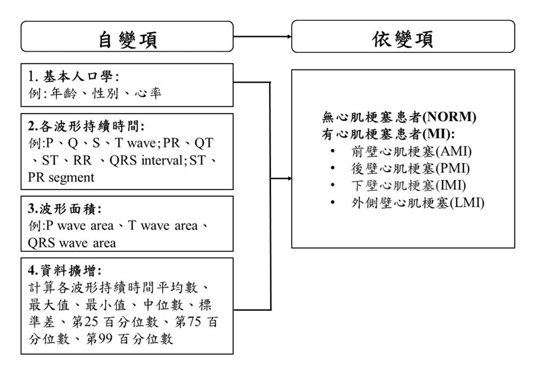
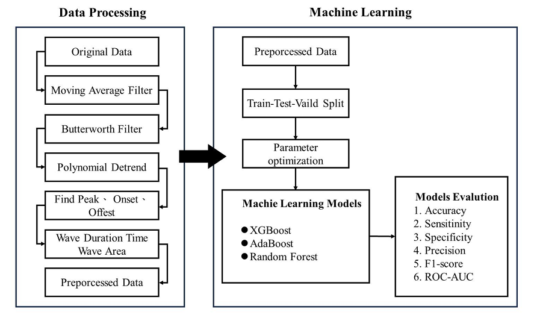

# 機器學習技術應用於心電圖波形與面積特徵輔助診斷心肌梗塞
---
## 摘要(Abstract)

世界衛生組織指出，心血管疾病是全球死亡的頭號殺手，每年造成約 1,790 萬人死亡，占全球總死亡人數的 32%。其中心肌梗塞（MI）是最常見的心血管疾病之一。

本研究利用公開的 PTB-XL 心電圖資料集，手動提取 17 個波形特徵（如心率、波形持續時間與面積），並計算其統計指標，最終擴增為 94 個變項。透過資料擴增與多種採樣策略，使用 XGBoost、Random Forest、AdaBoost 等集成模型進行訓練，並以 AUROC 評估效能。結果顯示 XGBoost 模型在多數子類別（AMI、PMI、IMI、LMI）皆有優異表現，最高 AUROC 達 95.7%。證明波形特徵與資料擴增策略可提升診斷心肌梗塞的效能。

---
## 研究目的(Research Purpose)
1. 提升心肌梗塞診斷準確度透過心電圖特徵提取：本研究旨在透過
從公開的12導聯心電圖數據集中手動提取波形和面積特徵，來提
高心肌梗塞的診斷準確度。 
2. 應用集成學習模型於心肌梗塞診斷：使用集成學習方法如隨機森
林、XGBoost和AdaBoost，開發輔心肌梗塞輔助診斷模型。 
3. 評估機器學習模型於心肌梗塞診斷的應用潛力：評估有無資料擴
增在不同機器學習模型預測心肌梗塞及其子類型的準確性。 
---
## 研究架構圖(Research Framework)



## 研究流程圖(Research Process)


## 專案架構（Project Structure）

```
ECG_MI_Thesis/
├── preprocessing/                # 訊號前處理（濾波、R峰、QRS 分段等）
│   ├── baseline_filter.py
│   ├── r_peak_detection.py
│   ├── rr_interval_detection.py
│   ├── QRS_interval and Q and S peak detection.py
│   ├── Q and S duration.py
│   ├── p_wave_duration and pr_segment and pr_interval.py
│   ├── t_wave_duration and st_segment.py
│   ├── QT interval and ST interval.py
├── features/                     # 特徵萃取（波形面積等）
│   ├── wave_area_calculation.py
│   └── extract_features.py
├── machine learning model/                       # 機器學習模型訓練
│   ├── XGBoost.py
│   ├── RandomForest.py
│   ├── AdaBoost.py
│ 
├── utils/                        # 輔助工具
│   └── sliding_window.py
├── data/                         # 原始與處理後的資料
│   ├── raw/
│   └── processed/
├── notebooks/                    # Notebook 示範
│   ├── signal_plot_demo.ipynb
│   └── feature_overview.ipynb
├── main.py                       # 主程式入口
├── requirements.txt              # 套件需求清單
└── README.md                     # 專案說明文件
```

---
## 資料說明(Data Description)

本研究所使用的資料為 PTB-XL ECG 資料集，來自 PhysioNet 由澳洲科學研究資料系列發表（Wagner et al., 2020），詳情如下：

- 資料名稱：PTB-XL: A large publicly available electrocardiography dataset

- 提供者：Physikalisch-Technische Bundesanstalt (PTB)

- 收錄時間：1989 年10 月至1996 年6 月

- 範圍：21,837 筆 ECG 繪圖，500Hz/100Hz可設定接受變化，每名病患 12 導聯時基本格式

- 系統資料格式：WFDB (.hea, .dat)

- 特徵量：分類標籤包含 5 種 Superclasses (NORM, MI, CD, HYP, STTC)、衆多 MI 子類別 (AMI, LMI, PMI, IMI)

🔗資料集連結：https://physionet.org/content/ptb-xl/1.0.1/

### 研究對象(Research Subjects)

本研究專注於分析心肌梗塞患者的心電圖數據。使用 PTB-XL ECG 資料集中標註為「Myocardial Infarction」的記錄，並進一步依照梗塞位置進行子分類，包括：

- AMI：前壁心肌梗塞 (anterior wall)
- LMI：側壁心肌梗塞 (lateral wall)
- PMI：後壁心肌梗塞 (posterior wall)
- IMI：下壁心肌梗塞 (inferior wall)

我們共整理出一組由 15,014 筆心電圖記錄組成的樣本，包含 9,528 筆正常 (NORM) 記錄，以及 5,486 筆心肌梗塞的 ECG 記錄。
<h4 align="center">PTB-XL 資料集診斷超類疾病記錄</h4>
<div align="center">
  <table>
    <thead>
      <tr>
        <th>Records</th>
        <th>Superclass</th>
        <th>Description</th>
      </tr>
    </thead>
    <tbody>
      <tr><td>9528</td><td>NORM</td><td>Normal ECG</td></tr>
      <tr><td>5486</td><td>MI</td><td>Myocardial Infarction</td></tr>
      <tr><td>5250</td><td>STTC</td><td>ST/T Change</td></tr>
      <tr><td>4907</td><td>CD</td><td>Conduction Disturbance</td></tr>
      <tr><td>2655</td><td>HYP</td><td>Hypertrophy</td></tr>
    </tbody>
  </table>
</div>

<h4 align="center">心肌梗塞子類別記錄</h4>

<div align="center">

<table>
  <thead>
    <tr>
      <th>Records</th>
      <th>Subclass</th>
      <th>Description</th>
    </tr>
  </thead>
  <tbody>
    <tr>
      <td>3281</td>
      <td>IMI</td>
      <td>Inferior Myocardial Infarction</td>
    </tr>
    <tr>
      <td>17</td>
      <td>PMI</td>
      <td>Posterior Myocardial Infarction</td>
    </tr>
    <tr>
      <td>1201</td>
      <td>LMI</td>
      <td>Lateral Myocardial Infarction</td>
    </tr>
    <tr>
      <td>3086</td>
      <td>AMI</td>
      <td>Anterior Myocardial Infarction</td>
    </tr>
  </tbody>
</table>

</div>

---

## 🧪 使用方法（How to Use）

```bash
# 安裝依賴套件
pip install -r requirements.txt

# 執行主流程
python main.py
```

或透過 `notebooks/` 目錄開啟 `.ipynb` 檔案進行可視化與分析。

---

## 技術亮點(Technical Highlights)

* ECG 訊號前處理(移動平均濾波、巴特沃斯濾波、基線校正)
* 波形偵測：R、Q、S、P、T 波定位
* 特徵提取：持續時間與積分面積
* XGBoost、RandomForest、AdaBoost模型建構與交叉驗證
* 評估指標：Accuracy、Recall、Precision、AUROC、F1-score


---
## 套件需求（Requirements）

請參閱 `requirements.txt`。

主要套件：

* `numpy`
* `pandas`
* `scipy`
* `matplotlib`
* `xgboost`
* `sklearn`

---

## 論文資訊(Thesis Info)

* 📘 題目：機器學習技術應用於心電圖波形與面積特徵輔助診斷心肌梗塞
* 🧑‍🎓 作者：陳榆臻
* 🏫 學校：輔仁大學 應用統計與資訊學系碩士班
* 📎 [國圖論文連結](https://ndltd.ncl.edu.tw/cgi-bin/gs32/gsweb.cgi?o=dnclcdr&s=id=%22112FJU00506013%22.&searchmode=basic)

---

## 聯絡方式(Contact)

📩 Email: [chenyuzhen355@gmail.com](mailto:chenyuzhen355@gmail.com)

---

> 💡 歡迎 Star ⭐ 專案，或提出 Issue 一起改進！
